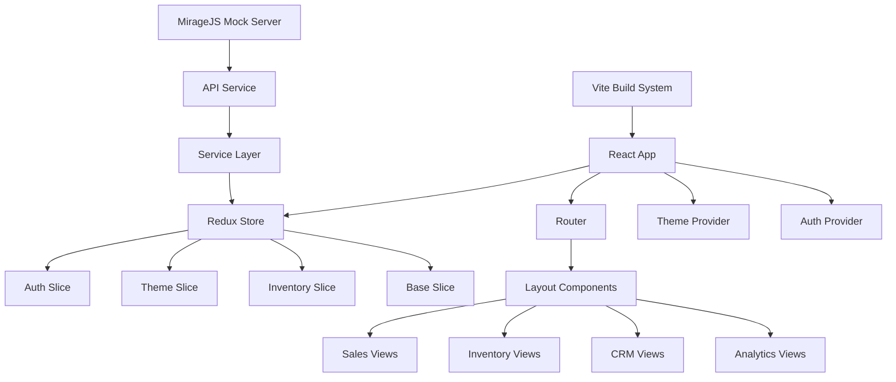

# Design Document

## Overview

The Elstar Dashboard is a comprehensive React-based admin panel built with TypeScript, featuring sales management, inventory tracking, CRM functionality, and analytics. The design focuses on creating a fully functional portfolio demo by fixing build issues, enhancing the mock data system, and ensuring all features work seamlessly without external dependencies.

## Architecture

### High-Level Architecture



### Technology Stack

- **Frontend Framework**: React 18 with TypeScript
- **State Management**: Redux Toolkit with Redux Persist
- **Routing**: React Router DOM v6
- **Styling**: Tailwind CSS with custom components
- **Build Tool**: Vite with custom plugins
- **Mock Server**: MirageJS for API simulation
- **Authentication**: Supabase (to be mocked for demo)
- **Charts**: ApexCharts and D3.js
- **UI Components**: Custom component library with Radix UI primitives

## Components and Interfaces

### Core Component Structure

```typescript
// Main application structure
interface AppStructure {
  layouts: {
    AuthLayout: React.ComponentType
    AppLayout: React.ComponentType
    BlankLayout: React.ComponentType
  }
  views: {
    sales: SalesViews
    inventory: InventoryViews
    crm: CRMViews
    analytics: AnalyticsViews
    auth: AuthViews
  }
  components: {
    ui: UIComponents
    shared: SharedComponents
    template: TemplateComponents
  }
}

// Service layer interfaces
interface ServiceLayer {
  ApiService: BaseApiService
  AuthService: AuthenticationService
  SalesService: SalesManagementService
  InventoryService: InventoryManagementService
  CommonService: SharedUtilitiesService
}
```

### Mock Data Architecture

```typescript
interface MockDataStructure {
  sales: {
    products: Product[]
    orders: Order[]
    customers: Customer[]
    analytics: SalesAnalytics
  }
  inventory: {
    items: InventoryItem[]
    categories: Category[]
    suppliers: Supplier[]
    movements: InventoryMovement[]
  }
  crm: {
    contacts: Contact[]
    leads: Lead[]
    opportunities: Opportunity[]
    activities: Activity[]
  }
  users: {
    profiles: UserProfile[]
    roles: Role[]
    permissions: Permission[]
  }
}
```

## Data Models

### Core Business Entities

```typescript
interface Product {
  id: string
  name: string
  description: string
  price: number
  category: string
  subcategory: string
  sku: string
  stock: number
  images: string[]
  status: 'active' | 'inactive' | 'discontinued'
  createdAt: Date
  updatedAt: Date
}

interface Order {
  id: string
  customerId: string
  items: OrderItem[]
  status: 'pending' | 'processing' | 'shipped' | 'delivered' | 'cancelled'
  total: number
  subtotal: number
  tax: number
  shipping: number
  paymentMethod: string
  shippingAddress: Address
  billingAddress: Address
  createdAt: Date
  updatedAt: Date
}

interface Customer {
  id: string
  firstName: string
  lastName: string
  email: string
  phone: string
  address: Address
  orders: string[]
  totalSpent: number
  status: 'active' | 'inactive'
  createdAt: Date
  lastOrderDate?: Date
}

interface InventoryItem {
  id: string
  productId: string
  quantity: number
  reservedQuantity: number
  reorderLevel: number
  reorderQuantity: number
  location: string
  lastRestocked: Date
  movements: InventoryMovement[]
}
```

### Authentication and User Management

```typescript
interface User {
  id: string
  email: string
  firstName: string
  lastName: string
  role: 'admin' | 'manager' | 'employee'
  permissions: Permission[]
  avatar?: string
  isActive: boolean
  lastLogin?: Date
  createdAt: Date
}

interface AuthState {
  user: User | null
  token: string | null
  isAuthenticated: boolean
  loading: boolean
  error: string | null
}
```

## Error Handling

### Error Boundary Implementation

```typescript
interface ErrorBoundaryState {
  hasError: boolean
  error: Error | null
  errorInfo: ErrorInfo | null
}

class GlobalErrorBoundary extends Component<Props, ErrorBoundaryState> {
  // Catch and handle React component errors
  // Display user-friendly error messages
  // Log errors for debugging
}
```

### API Error Handling

```typescript
interface ApiErrorResponse {
  status: number
  message: string
  code: string
  details?: Record<string, unknown>
}

interface ErrorHandlingStrategy {
  networkErrors: () => void
  validationErrors: (errors: ValidationError[]) => void
  authenticationErrors: () => void
  serverErrors: () => void
  notFoundErrors: () => void
}
```

## Testing Strategy

### Component Testing Approach

- **Unit Tests**: Focus on individual component logic and utilities
- **Integration Tests**: Test component interactions and data flow
- **Mock Testing**: Verify mock server responses and API integration
- **Visual Testing**: Ensure UI consistency across different states

### Test Structure

```typescript
interface TestingFramework {
  unitTests: {
    components: ComponentTest[]
    utilities: UtilityTest[]
    services: ServiceTest[]
  }
  integrationTests: {
    userFlows: UserFlowTest[]
    apiIntegration: ApiIntegrationTest[]
    stateManagement: StateTest[]
  }
  e2eTests: {
    criticalPaths: E2ETest[]
    crossBrowser: BrowserTest[]
  }
}
```

## Build System Fixes

### Vite Configuration Enhancements

1. **Dependency Resolution**: Fix @babel/runtime issues
2. **Plugin Configuration**: Optimize React and TypeScript plugins
3. **Asset Handling**: Improve static asset management
4. **Development Server**: Configure proper proxy and HMR
5. **Build Optimization**: Minimize bundle size and improve performance

### TypeScript Configuration

```typescript
interface TypeScriptConfig {
  compilerOptions: {
    target: 'ES2020'
    lib: ['ES2020', 'DOM', 'DOM.Iterable']
    allowJs: false
    skipLibCheck: true
    esModuleInterop: true
    allowSyntheticDefaultImports: true
    strict: true
    forceConsistentCasingInFileNames: true
    moduleResolution: 'node'
    resolveJsonModule: true
    isolatedModules: true
    noEmit: true
    jsx: 'react-jsx'
  }
  include: ['src']
  exclude: ['node_modules', 'build']
}
```

## Mock Server Enhancement

### MirageJS Configuration

```typescript
interface MockServerConfig {
  environment: 'development' | 'production'
  timing: number
  logging: boolean
  trackRequests: boolean
  seeds: MockDataSeeds
  routes: RouteDefinitions
  serializers: SerializerConfig
}
```

### API Endpoint Coverage

- **Authentication**: Login, logout, token refresh, user profile
- **Sales**: Products CRUD, orders management, customer data
- **Inventory**: Stock management, movements, categories
- **CRM**: Contacts, leads, opportunities, activities
- **Analytics**: Dashboard data, reports, charts
- **File Upload**: Image handling for products and profiles

## Performance Optimization

### Code Splitting Strategy

```typescript
interface CodeSplittingStrategy {
  routeLevel: {
    sales: () => import('./views/sales')
    inventory: () => import('./views/inventory')
    crm: () => import('./views/crm')
    analytics: () => import('./views/analytics')
  }
  componentLevel: {
    charts: () => import('./components/charts')
    tables: () => import('./components/tables')
    forms: () => import('./components/forms')
  }
}
```

### State Management Optimization

- **Redux Toolkit**: Minimize boilerplate and improve performance
- **Selectors**: Memoized selectors for expensive computations
- **Middleware**: Custom middleware for API calls and caching
- **Persistence**: Selective state persistence for user preferences

## Security Considerations

### Demo Security Measures

```typescript
interface SecurityMeasures {
  authentication: {
    demoCredentials: DemoCredentials
    sessionManagement: SessionConfig
    routeProtection: RouteGuards
  }
  dataProtection: {
    inputSanitization: SanitizationRules
    xssProtection: XSSPreventionConfig
    csrfProtection: CSRFConfig
  }
  apiSecurity: {
    rateLimiting: RateLimitConfig
    requestValidation: ValidationRules
    errorHandling: SecurityErrorHandling
  }
}
```

## Responsive Design

### Breakpoint Strategy

```typescript
interface ResponsiveBreakpoints {
  mobile: '320px - 768px'
  tablet: '768px - 1024px'
  desktop: '1024px - 1440px'
  largeDesktop: '1440px+'
}

interface ResponsiveComponents {
  navigation: AdaptiveNavigation
  tables: ResponsiveTables
  charts: ResponsiveCharts
  forms: AdaptiveForms
  modals: ResponsiveModals
}
```

## Deployment Configuration

### Build Optimization

```typescript
interface BuildConfig {
  bundleAnalysis: BundleAnalyzerConfig
  assetOptimization: AssetOptimizationConfig
  caching: CacheStrategyConfig
  compression: CompressionConfig
  serviceWorker: PWAConfig
}
```

### Environment Configuration

- **Development**: Hot reload, detailed error messages, mock server enabled
- **Production**: Optimized builds, error boundaries, analytics tracking
- **Demo**: Mock server enabled, sample data preloaded, guest authentication